<p align="center">
  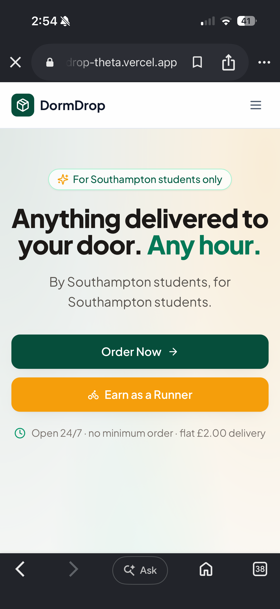
  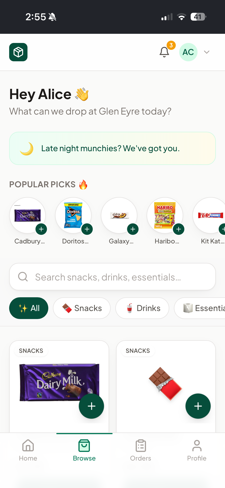
  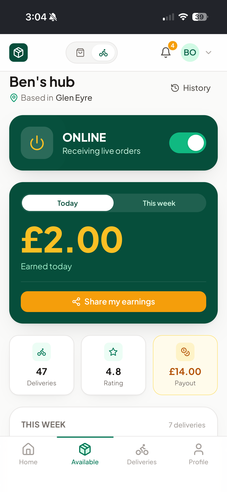
</p>

<h1 align="center">💧 DormDrop</h1>

<p align="center">
  <strong>Peer-to-peer student delivery. Built for the University of Southampton.</strong><br/>
  Students order snacks, drinks and essentials — fellow students deliver them. 24/7, no minimum.
</p>

<p align="center">
  
  
  
  
  
  
</p>

---

## The Story

I built DormDrop in my **first year** at the University of Southampton. The idea was simple: students are awake at all hours, they want snacks and essentials delivered, and other students want to make money. So I built the platform that connects them.

It worked. **Hundreds of students** across campus signed up — requesters ordering at midnight, runners earning between lectures. Real orders, real payments, real deliveries across Glen Eyre, Wessex Lane, Portswood and beyond.

I had to shut it down midway through **second semester** due to issues with the university. But the product was real, the users were real, and the code is all here.

This repo is the full production codebase — not a tutorial, not a demo. Everything from authentication to payments to live GPS tracking to an admin dashboard with analytics. ~12,000 lines of TypeScript, 7 database migrations, and a lot of late nights.

---

## What It Does

**For students who want stuff delivered:**

<p align="center">
  
  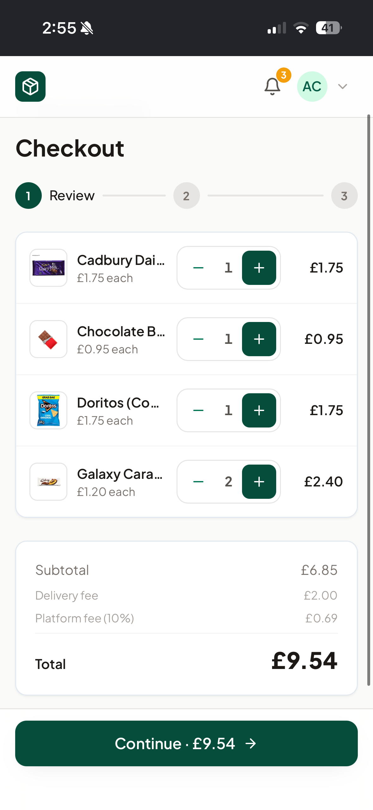
  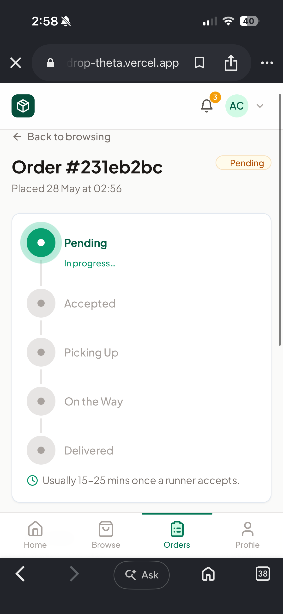
</p>

- Browse a real catalogue with product images, instant search, category filters
- Add items to a persistent cart, adjust quantities
- 3-step checkout (review → delivery address → Stripe payment)
- Live order tracking — watch your order go from Pending → Accepted → Picking Up → Delivered in real-time
- Rate your runner after delivery, reorder past orders with one tap

**For students who want to earn:**

<p align="center">
  
  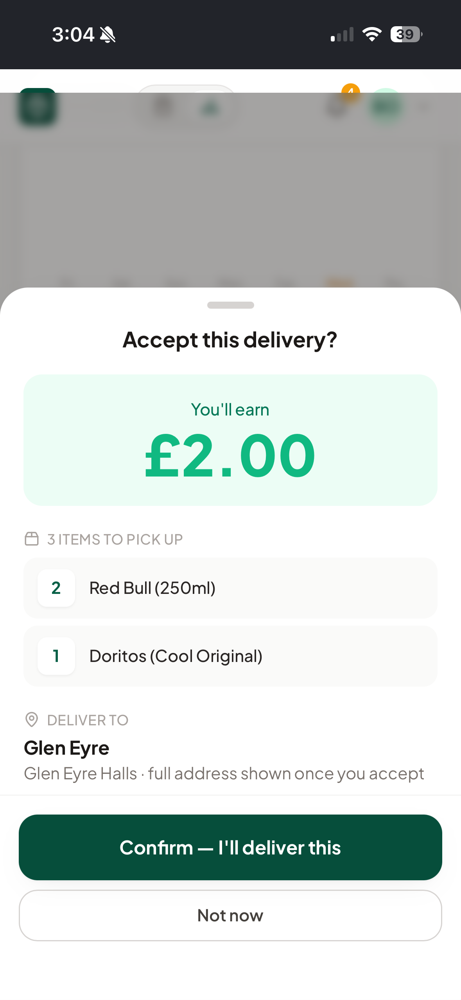
  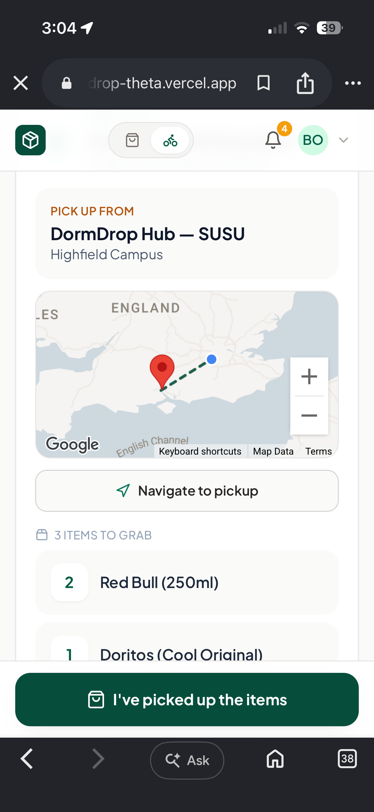
</p>

- Go online/offline with a power switch — only receive orders when you want to
- See available orders in real-time, with earnings front and centre
- Accept an order → see what to pick up → navigate to the collection point → deliver to the requester
- GPS tracking with Google Maps, walking directions to pickup and delivery
- Banking-style earnings dashboard, delivery history, share your earnings

**The delivery flow:**

<p align="center">
  
  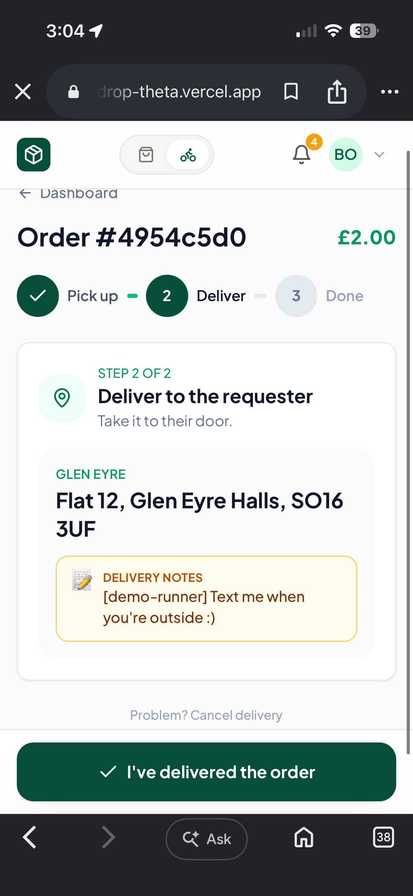
  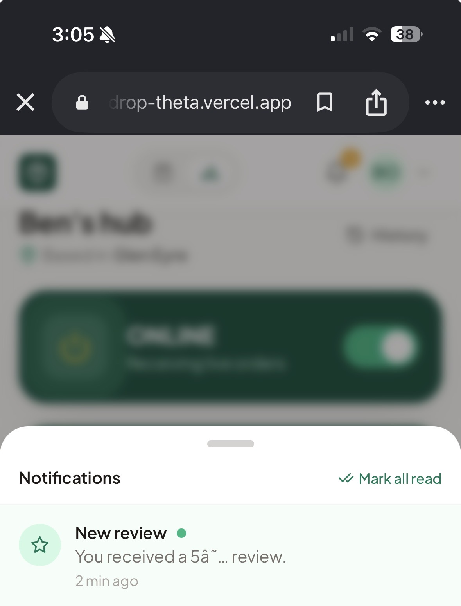
</p>

---

## Features

### Core Platform
- **Dual-role accounts** — order, deliver, or both. Switch with one tap
- **Real-time everything** — order status, runner feed, notifications, all live via Supabase Realtime
- **Stripe payments** — secure checkout with webhook-verified payment flow
- **Race-safe order claiming** — atomic database RPC prevents two runners accepting the same order
- **@soton.ac.uk email gate** — restricted to University of Southampton students

### Maps & Tracking
- **Google Maps integration** — address autocomplete, zone maps, delivery tracking
- **Live GPS tracking** — runner location broadcasts to the requester in real-time
- **Collection points** — runners navigate to designated pickup locations (SUSU, Portswood)
- **Distance-based delivery fees** — calculated from real coordinates
- **Smart ETAs** — estimated delivery time based on walking distance

### Trust & Engagement
- **Star ratings + reviews** — rate runners after delivery, DB trigger recomputes averages
- **In-app notifications** — order updates, new orders nearby, reviews, all in real-time
- **Share earnings** — runners can generate and share branded earnings cards
- **Sound + haptics** — Web Audio "ping" for new orders, "cha-ching" on delivery completion

### Admin Dashboard
- **Metrics + charts** — orders, revenue, active runners, avg delivery time (Recharts)
- **Order management** — search, filter, status override, cancel/refund
- **User management** — search, suspend/unsuspend, view order history
- **Item management** — add/edit/soft-delete catalogue items, toggle stock
- **Analytics** — zone breakdown, runner leaderboard, completion rate

### Production Quality
- **PWA** — installable on mobile, offline page via service worker
- **Rate limiting** — per-user fixed-window on all write paths
- **Security headers** — nosniff, DENY framing, strict referrer policy
- **RLS on every table** — row-level security isolates user data
- **Loading skeletons + error boundaries** on every route
- **iOS safe-area support** — works properly with the notch and home indicator

---

## Tech Stack

| Layer | Technology |
|-------|-----------|
| Framework | **Next.js 14** (App Router, Server Components, TypeScript) |
| Styling | **Tailwind CSS** (Plus Jakarta Sans, custom emerald + amber brand) |
| Database | **Supabase** (PostgreSQL, Auth, Row Level Security, Realtime, Storage) |
| Payments | **Stripe** (Checkout Sessions, Webhooks) |
| Maps | **Google Maps** (Maps JS API, Places Autocomplete, Geocoding) |
| Charts | **Recharts** (admin dashboard) |
| Hosting | **Vercel** |
| Icons | **Lucide React** |

---

## Screenshots

<details>
<summary><strong>Landing Page</strong></summary>
<p align="center">
  
  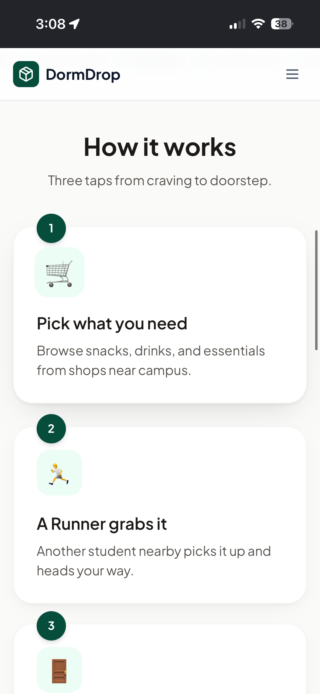
</p>
</details>

<details>
<summary><strong>Ordering Experience</strong></summary>
<p align="center">
  
  
</p>
</details>

<details>
<summary><strong>Order Tracking</strong></summary>
<p align="center">
  
  
</p>
</details>

<details>
<summary><strong>Runner Experience</strong></summary>
<p align="center">
  
  
</p>
<p align="center">
  
  
</p>
</details>

<details>
<summary><strong>Admin Dashboard</strong></summary>
<p align="center">
  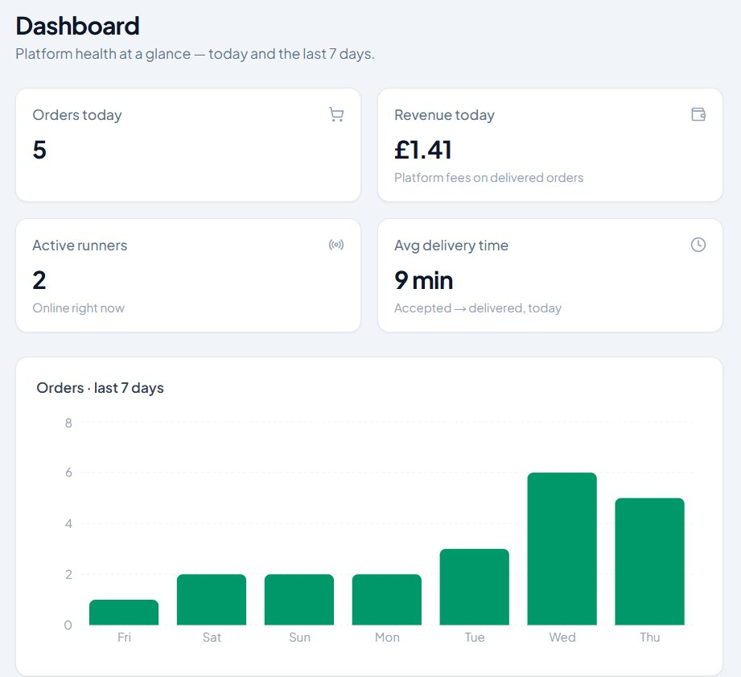
</p>
<p align="center">
  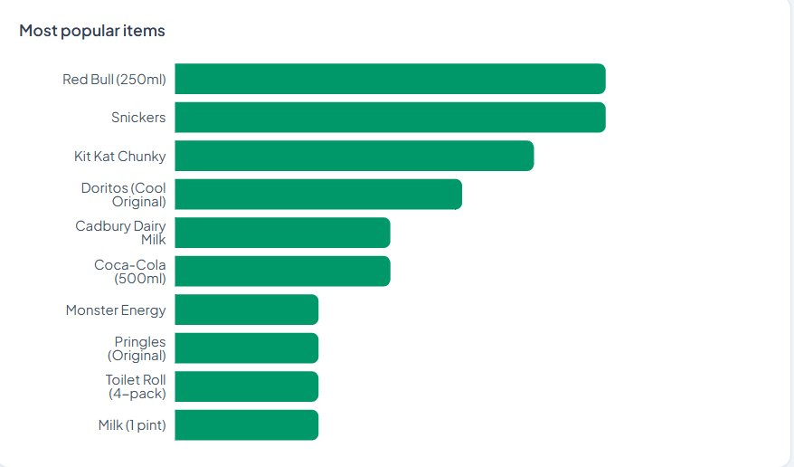
  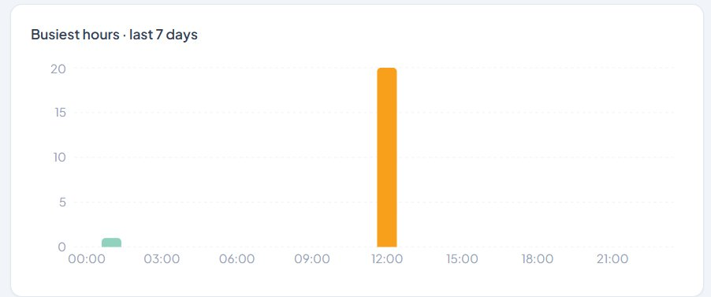
</p>
</details>

---

## Project Structure

```
app/
  page.tsx                          Landing page
  (auth)/                           Login, signup, forgot/reset password
  onboarding/                       Name, phone, role, delivery zone
  (dashboard)/requester/            Browse → checkout → orders → tracking
  (dashboard)/runner/               Dashboard → accept → pickup → deliver
  (dashboard)/profile/              Account, stats, reviews
  admin/                            Dashboard, orders, users, items, analytics
  help/                             FAQ + report a problem
  api/                              Orders, checkout, reviews, webhooks, admin
components/
  ui/          Button, Card, Modal, Input, StarRating, Skeleton...
  layout/      Navbar, BottomNav, DashboardNavbar
  orders/      ItemCard, CheckoutFlow, OrderDetail, StatusTracker
  runner/      RunnerDashboard, ActiveDelivery, AvailableOrderCard
  map/         GoogleMap, AddressAutocomplete
  notifications/  NotificationBell (realtime)
  reviews/     RateRunnerForm, ReviewPromptModal
hooks/
  useOrderSubscription.ts           Realtime order state
  useAvailableOrders.ts             Realtime runner feed
lib/
  supabase.ts, stripe.ts, admin.ts, constants.ts, utils.ts,
  rate-limit.ts, sounds.ts, share-card.ts
supabase/migrations/                7 migration files (0001–0007)
```

---

## Local Setup

**Prerequisites:** Node 18+, a [Supabase](https://supabase.com) project, a [Stripe](https://stripe.com) account, the [Stripe CLI](https://stripe.com/docs/stripe-cli), and optionally a [Google Maps API key](https://console.cloud.google.com).

```bash
# Clone and install
git clone https://github.com/YOUR_USERNAME/dormdrop.git
cd dormdrop
npm install

# Configure environment
cp .env.example .env.local
# Fill in your Supabase URL, keys, Stripe keys, etc.

# Set up the database
# Run each file in supabase/migrations/ in order via the Supabase SQL Editor
# Run 0003 on its own (ALTER TYPE limitation)

# Seed demo data
npm run seed

# Start the Stripe webhook forwarder (required for payments)
stripe listen --forward-to localhost:3000/api/webhooks/stripe
# Copy the whsec_... into .env.local as STRIPE_WEBHOOK_SECRET

# Run
npm run dev
```

Open `http://localhost:3000`. Login with any seeded user (password: `password123`).

---

## Environment Variables

| Variable | Scope | Purpose |
|----------|-------|---------|
| `NEXT_PUBLIC_SUPABASE_URL` | Public | Supabase project URL |
| `NEXT_PUBLIC_SUPABASE_ANON_KEY` | Public | Supabase anon key (RLS-scoped) |
| `SUPABASE_SERVICE_ROLE_KEY` | Server | Bypasses RLS (webhooks, admin) |
| `STRIPE_SECRET_KEY` | Server | Stripe server SDK |
| `NEXT_PUBLIC_STRIPE_PUBLISHABLE_KEY` | Public | Stripe.js |
| `STRIPE_WEBHOOK_SECRET` | Server | Webhook signature verification |
| `NEXT_PUBLIC_APP_URL` | Public | Base URL for redirects and OG tags |
| `NEXT_PUBLIC_GOOGLE_MAPS_KEY` | Public | Maps, autocomplete, tracking |
| `RESEND_API_KEY` | Server | Email notifications (optional) |
| `REPORT_EMAIL_TO` | Server | Where problem reports are sent (optional) |

---

## Database

7 migrations, run in order:

| Migration | What it adds |
|-----------|-------------|
| `0001_initial_schema` | Core tables, enums, RLS, auth trigger, indexes |
| `0002_onboarding` | `profiles.onboarding_completed` |
| `0003_awaiting_payment` | Payment status enum *(run alone)* |
| `0004_payouts_and_claim` | Payouts, atomic order claiming, delivery trigger |
| `0005_reviews_notifications` | Notifications, presence, review/notify triggers |
| `0006_admin` | Admin flags, suspension, soft delete, email sync |
| `0007_reports` | Problem report submissions |

RLS is enabled on every table. The admin panel verifies `is_admin` server-side then uses the service-role client.

---

## Deployment

Full guide in [DEPLOYMENT.md](DEPLOYMENT.md). The short version:

1. Push to GitHub → import into Vercel
2. Set all env vars in Vercel (Production)
3. Run migrations on your production Supabase project
4. Switch Stripe to live keys, add the production webhook
5. Add your custom domain, update `NEXT_PUBLIC_APP_URL`

Testing checklist for every user journey: [TESTING.md](TESTING.md)

---

## Roadmap

If the university hadn't stepped in, this is where it was going:

- 📱 **Native iOS/Android apps** (React Native)
- 💬 **In-app chat** between requester and runner
- 🔔 **Push notifications** (web push + native)
- 💳 **Stripe Connect** — automatic weekly runner payouts
- 🤖 **Smart recommendations** — "You usually order Red Bull at 11pm"
- 👥 **Group orders** — your whole flat, one delivery
- ⏰ **Scheduled deliveries** — "Deliver at 8am tomorrow"
- 🎓 **Multi-campus expansion** — other UK universities
- 🪪 **Student ID verification** — safety and trust

---

## Lessons Learned

Building a two-sided marketplace as a first-year taught me more than any module:

- **Start with the simplest thing that works.** The first version was ugly. People used it anyway because it solved a real problem.
- **Real users find bugs you never imagined.** Two runners accepting the same order at 2am. A cancelled order that didn't refund the stock. Edge cases only surface under real traffic.
- **Growth is easier than retention.** Getting 100 users to sign up was easy. Getting 20 to open the app the next week was the real challenge.
- **Universities don't like unlicensed delivery services.** Lesson learned.

---

<p align="center">
  <sub>Built with a lot of caffeine and not enough sleep at the University of Southampton.</sub><br/>
  <sub>First year, 2024–25.</sub>
</p>
